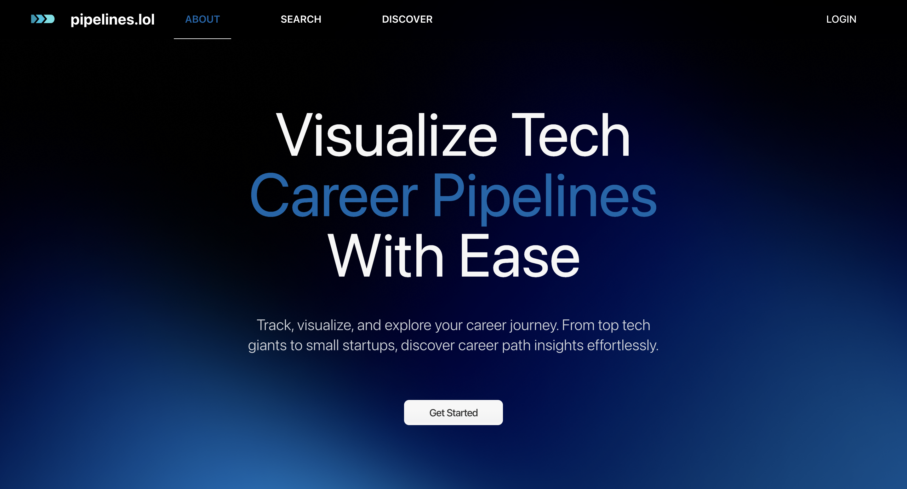

# [Pipelines](https://pipelines.lol)

Welcome to the official repository of the Pipelines project. Our goal is to help you find your next company.

<!-- [![Contributors][contributors-shield]][contributors-url] [![Forks][forks-shield]][forks-url] [![Stargazers][stars-shield]][stars-url] [![Issues][issues-shield]][issues-url] [![MIT License][license-shield]][license-url] [![LinkedIn][linkedin-shield]][linkedin-url] -->

<!-- ## Getting Started

The codebase is a monolithic repository split into both a frontend and a backend. The frontend is built with React and the backend is built with Node.js. To get started, clone the repository and follow the instructions below. -->

### Pipelines is proud to be built with:

[![MongoDB][MongoDB]][MongoDB-url][![Express.js][Express.js]][Express-url][![React.js][React.js]][React-url][![Node.js][Node.js]][Node.js-url]

<!-- ## Installation

Coming soon! -->

<!--
Coming soon
1. Fork the repository by going to [this link](https://github.com/pipelines-lol/pipelines/fork).

2. Clone the repository

   ```sh
   git clone <your-forked-repo-url>
   ```

3. Get environment variables from the project owner

We're currently working on a way to make this process easier. Stay tuned!

4. Install NPM packages

   ```sh
   cd frontend
    npm install
    cd ../backend
    npm install
   ```

5. Start the frontend and backend

   ```sh
    cd frontend
    npm start
    cd ../backend
    npm run dev
   ``` -->

## License

Pipelines is distributed under the MIT License. See our [LICENSE](LICENSE) details for more information.

## Contact Us

[![Email][email-shield]][email-url]
[![LinkedIn][linkedin-shield]][linkedin-url]
[![Discord][discord-shield]][discord-url]

## Contributors

<a href="https://github.com/pipelines-lol/pipelines/graphs/contributors">
  
</a>

## Contributing

We're always looking for contributors to help us improve the project. However, we're currently in the process of setting up the project for contributions.

If you're interested in contributing, please read our [Contributing Guidelines](CONTRIBUTING.md) and [Code of Conduct](CODE_OF_CONDUCT.md) before submitting a pull request. To report a bug or request a feature, please open an issue by using the [issues tab](https://github.com/pipelines-lol/pipelines/issues).

## Acknowledgements

- [Img Shields](https://shields.io)
- [Choose an Open Source License](https://choosealicense.com)
- [contrib.rocks](https://contrib.rocks)
- [TalkToBeavs](https://talktobeavs.onrender.com)
- [Lucide](https://lucide.dev)
- [Font Awesome](https://fontawesome.com)

[contributors-shield]: https://img.shields.io/github/contributors/pipelines-lol/pipelines.svg?style=for-the-badge
[contributors-url]: https://github.com/pipelines-lol/pipelines/graphs/contributors
[forks-shield]: https://img.shields.io/github/forks/pipelines-lol/pipelines.svg?style=for-the-badge
[forks-url]: https://github.com/pipelines-lol/pipelines/network/members
[email-shield]: https://img.shields.io/badge/Email-4285F4?style=for-the-badge&logo=gmail&logoColor=white
[email-url]: mailto:support@pipelines.lol
[discord-shield]: https://img.shields.io/discord/1226757437047050250?style=for-the-badge&logo=discord&label=Discord%20Community
[discord-url]: https://discord.gg/nQu82sczTN
[stars-shield]: https://img.shields.io/github/stars/pipelines-lol/pipelines.svg?style=for-the-badge
[stars-url]: https://github.com/pipelines-lol/pipelines/stargazers
[issues-shield]: https://img.shields.io/github/issues/pipelines-lol/pipelines.svg?style=for-the-badge
[issues-url]: https://github.com/pipelines-lol/pipelines/issues
[license-shield]: https://img.shields.io/github/license/pipelines-lol/pipelines.svg?style=for-the-badge
[license-url]: https://github.com/pipelines-lol/pipelines/blob/master/LICENSE
[linkedin-shield]: https://img.shields.io/badge/-LinkedIn-black.svg?style=for-the-badge&logo=linkedin&colorB=555
[linkedin-url]: https://www.linkedin.com/company/pipelines-lol/
[product-screenshot]: preview.png
[React.js]: https://img.shields.io/badge/React-20232A?style=for-the-badge&logo=react&logoColor=61DAFB
[React-url]: https://reactjs.org/
[Node.js]: https://img.shields.io/badge/Node.js-43853D?style=for-the-badge&logo=node.js&logoColor=white
[Node-url]: https://nodejs.org/en/
[Express.js]: https://img.shields.io/badge/Express.js-000000?style=for-the-badge&logo=express&logoColor=white
[Express-url]: https://expressjs.com/
[JavaScript]: https://img.shields.io/badge/JavaScript-F7DF1E?style=for-the-badge&logo=javascript&logoColor=black
[JavaScript-url]: https://www.javascript.com/
[MongoDB]: https://img.shields.io/badge/MongoDB-4EA94B?style=for-the-badge&logo=mongodb&logoColor=white
[MongoDB-url]: https://www.mongodb.com/
[Node.js]: https://img.shields.io/badge/Node.js-43853D?style=for-the-badge&logo=node.js&logoColor=white
[Node.js-url]: https://nodejs.org/en/
